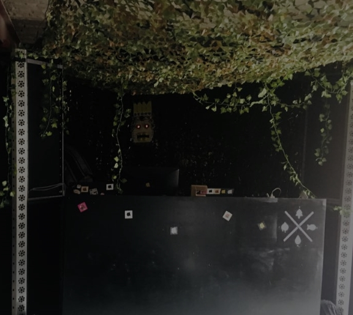
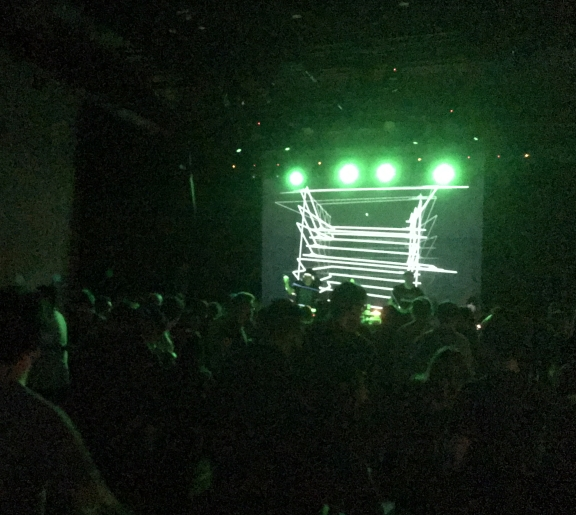

<!-- Main -->

<!-- One -->
<section id="one">
	

		<header class="major">
			<h2>Unsere Events</h2>
		</header>
		
Wir sind schon seit mehreren Jahren um Darmstadt aktiv. Dabei haben wir bereits Open Air Veranstaltungen, private Events und auch große Clubevents bestritten. Musikalisch sind wir relativ divers, legen aber unseren Fokus auf entspannte Sounds und Bassmusik.

	

</section>

<!-- Two -->
<section id="two" class="spotlights">
	<section>
		
		

			

				<header class="major">
					<h3>BDF 2018</h3>
				</header>
				
Das Burning Down Fischbachtal Festival ist ein kuscheliges kleines Musikfestival im Odenwald. An zwei Tagen spielen tagsüber Bands, abends wird der Spaß dann mit Clubmusik verlängert. Hier hatten wir das erste mal einen kompletten Dschungel aufgebaut

			

		

	</section>
	<section>
		
		

			

				<header class="major">
					<h3>Tief Frequenz Festival 2018</h3>
				</header>
				
Wir hatten die Gelegenheit auf dem Tief Frequenz Festival 2018 einen Noise Test Floor zu organisieren. Mit dabei waren inmachineswetrust, Kit Kurse, lums, die audiovsn Crew und Kabuki. Außerdem konnten wir unser Visual das erste mal auf einer richtig großen Projektionsfläche testen.

			

		

	</section>
</section>

